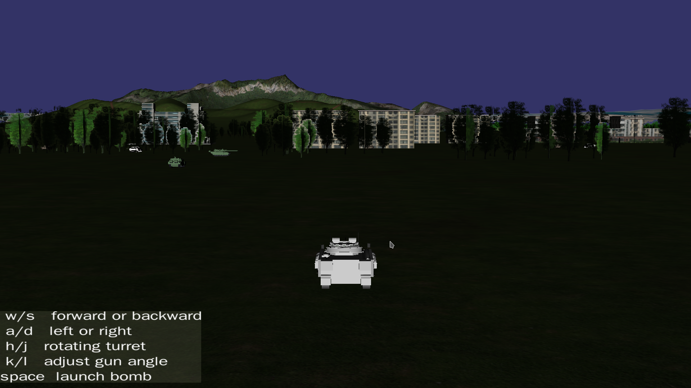
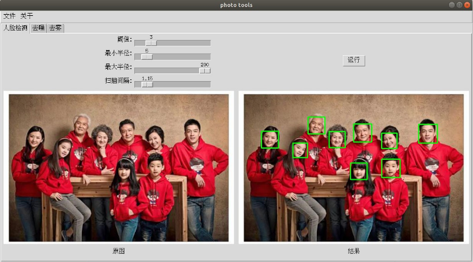

### 求star！求star！求star！

# computer_graph_and_image_job

> 这个仓库是计算机图形学的结课作业

> 这个作业有两部分组成

- 图形部分: 用c++的openscenegraph库实现了一个坦克大战程序。
- 图像部分: 用python3实现了一个GUI程序，该程序包含三个图像处理功能，分别是人脸识别，图像加噪和去噪，图像去雾。

## 图形部分

坦克大战程序运行的最终效果图

各版本的代码实现功能介绍:

NPS_Data里装的是模型文件包括地形、坦克各部件等.

- myTankv1.cpp :实现了用wsad操控坦克运动
- myTankv2.cpp:手动组装了一个坦克，并新增zxcv操控坦克的炮塔旋转和调整枪口的角度
- myTankv3.cpp:添加了地形，新增了镜头跟随功能。
- myTankv4.cpp:新增了坦克适应地形运动。
- myTankv5.cpp:新增坦克运动的扬尘特效
- myTankv6.cpp:新增坦克发射子弹功能，子弹发射时的枪口火焰，子弹落地时的爆炸特效
- myTankv7.cpp:新增敌军，静止敌军和运动敌军，静止敌军位置随机
- myTankv8.cpp:新增HUD界面提示

## 图像部分

最终效果展示

简单说明：

- 人脸检测模块实现了Haar级联分类器用于人脸定位
- 去噪模块实现了2种方式的加噪和3种方式的去噪
- 去雾模块实现了暗通道去雾